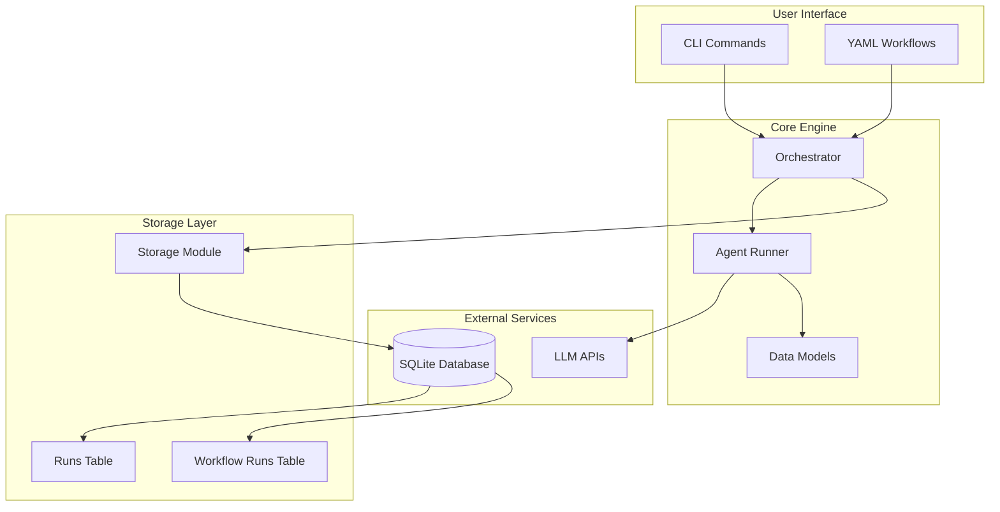
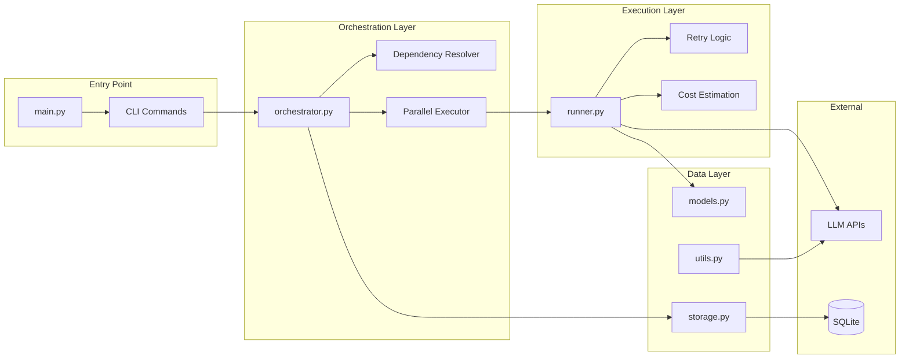
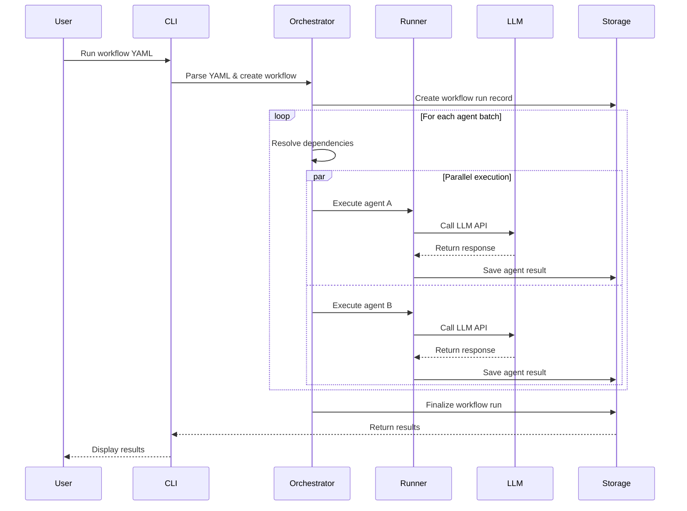
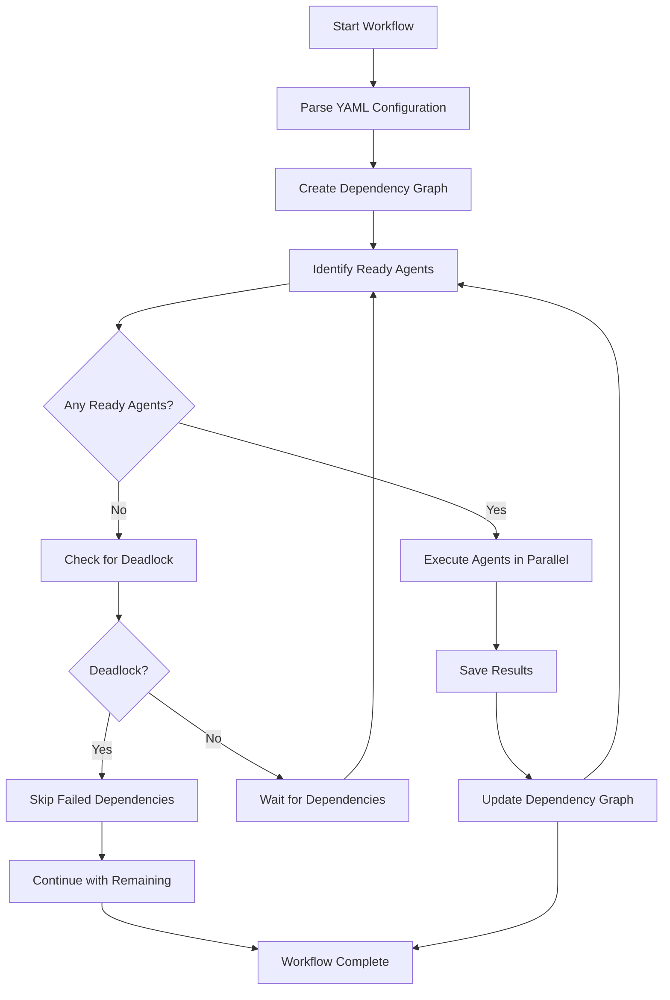
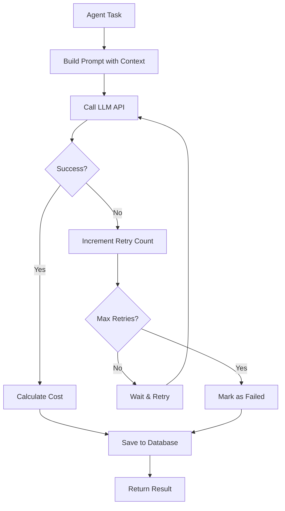

# AgentOps 🚀

A minimal orchestration runtime for multi-agent workflows. Define complex AI agent pipelines using simple YAML configuration files with dependency management, parallel execution, and cost tracking.

## ✨ Features

- 🎯 **YAML-Defined Workflows** - Simple configuration for complex agent pipelines
- 🔄 **Dependency Management** - Agents can depend on other agents with AND/OR semantics
- ⚡ **Parallel Execution** - Run independent agents concurrently for maximum efficiency
- 🔁 **Retry Logic** - Built-in retry mechanism with configurable attempts
- 💰 **Cost Tracking** - Monitor and estimate costs for each agent run
- 💾 **SQLite Persistence** - Store run history, outputs, and metadata
- 🎨 **Rich CLI** - Beautiful terminal output with real-time progress
- 🔌 **LLM Integration** - Support for Azure OpenAI and OpenAI APIs

## 🏗️ Architecture

### System Overview



### Component Architecture



### Data Flow Diagram



## 📁 Project Structure

```
agentops/
├── __init__.py              # Package initialization
├── __main__.py              # Module entry point
├── main.py                  # CLI interface with Typer
├── orchestrator.py          # Workflow execution engine
├── runner.py                # Individual agent execution
├── models.py                # Pydantic data models
├── storage.py               # SQLite persistence layer
├── utils.py                 # LLM integration utilities
├── requirements.txt         # Python dependencies
├── .gitignore              # Git ignore rules
├── agentops.db             # SQLite database (created at runtime)
└── examples/               # Example workflow configurations
    ├── sample_workflow.yaml
    ├── parallel_workflow.yaml
    └── creative_workflow.yaml
```

## 🚀 Quick Start

### Installation

```bash
# Clone the repository
git clone https://github.com/yourusername/agentops.git
cd agentops

# Install dependencies
pip install -r requirements.txt

# Set up environment variables
export AZURE_GPT5_KEY="your-azure-key"
export AZURE_GPT5_ENDPOINT="your-azure-endpoint"
export AZURE_GPT5_VERSION="2024-02-15-preview"
export AZURE_GPT5_DEPLOYMENT="your-deployment-name"
```

### Basic Usage

```bash
# Run a simple workflow
python -m agentops run examples/sample_workflow.yaml

# List recent runs
python -m agentops list-runs

# Show runs for a specific workflow
python -m agentops show-runs --workflow research_summary

# Show detailed run information
python -m agentops show-run 1
```

## 📋 Workflow Configuration

### YAML Schema

```yaml
name: workflow_name
description: "Optional workflow description"
policies:
  retries: 2
  cost_cap: 1.00

agents:
  - name: agent_name
    model: gpt-4o
    task: "Agent task description"
    depends_on: "single_dependency"  # or ["dep1", "dep2"] for multiple
```

### Example Workflows

#### Simple Sequential Workflow
```yaml
name: research_summary
description: Simple two-agent workflow example
policies:
  retries: 2
  cost_cap: 1.00

agents:
  - name: researcher
    model: gpt-4o
    task: "Find top 3 YC Requests for Startups related to AI infrastructure."
  - name: summarizer
    model: gpt-4o-mini
    depends_on: researcher
    task: "Summarize the researcher's findings in 100 words."
```

#### Complex Parallel Workflow
```yaml
name: parallel_data_pipeline
description: "6-agent pipeline with parallel gatherers"
policies:
  retries: 2
  cost_cap: 2.00

agents:
  - name: news_gatherer
    model: gpt-4o
    task: "Find 3 recent tech news headlines and brief summaries."
  
  - name: weather_gatherer
    model: gpt-4o
    task: "Get current weather information for major cities."
  
  - name: market_gatherer
    model: gpt-4o
    task: "Provide current stock market overview and trending stocks."

  - name: data_analyzer
    model: gpt-4o
    depends_on: [news_gatherer, weather_gatherer, market_gatherer]
    task: "Analyze the gathered data and identify key insights."
  
  - name: trend_spotter
    model: gpt-4o
    depends_on: [news_gatherer, weather_gatherer, market_gatherer]
    task: "Identify emerging trends and correlations."

  - name: report_beautifier
    model: gpt-4o
    depends_on: [data_analyzer, trend_spotter]
    task: "Create a beautiful, formatted report combining all analysis."
```

## 🗄️ Database Schema

### Runs Table
```sql
CREATE TABLE runs (
    id INTEGER PRIMARY KEY AUTOINCREMENT,
    workflow_run_id INTEGER,
    workflow TEXT,
    agent TEXT,
    status TEXT,
    cost REAL,
    output TEXT,
    error TEXT,
    retries INTEGER
);
```

### Workflow Runs Table
```sql
CREATE TABLE workflow_runs (
    id INTEGER PRIMARY KEY AUTOINCREMENT,
    workflow TEXT,
    started_at DATETIME DEFAULT CURRENT_TIMESTAMP,
    finished_at DATETIME
);
```

## 🔧 Configuration

### Environment Variables

| Variable | Description | Required |
|----------|-------------|----------|
| `AZURE_GPT5_KEY` | Azure OpenAI API key | Yes |
| `AZURE_GPT5_ENDPOINT` | Azure OpenAI endpoint URL | Yes |
| `AZURE_GPT5_VERSION` | API version | Yes |
| `AZURE_GPT5_DEPLOYMENT` | Deployment name (optional) | No |

### Model Configuration

Each agent can specify its own model:
- `gpt-4o` - Most capable model
- `gpt-4o-mini` - Faster, cost-effective model
- Any Azure OpenAI deployment name

## 📊 CLI Commands

| Command | Description | Options |
|---------|-------------|---------|
| `run <yaml_path>` | Execute a workflow from YAML file | - |
| `list-runs` | List recent agent runs | `--limit` |
| `show-runs` | Show runs for specific workflow | `--workflow`, `--limit` |
| `list-workflow-runs` | List workflow execution groups | `--workflow` |
| `show-run <run_id>` | Show detailed run information | - |

## 🔄 Execution Flow

### Dependency Resolution Algorithm



### Agent Execution Process



## 🛠️ Development

### Running Tests

```bash
# Run the example workflows
python -m agentops run examples/sample_workflow.yaml
python -m agentops run examples/parallel_workflow.yaml
```

### Adding New LLM Providers

To add support for new LLM providers, modify `utils.py`:

```python
async def call_llm(model: str, task: str) -> str:
    # Add your LLM provider integration here
    pass
```

### Extending Data Models

Add new fields to `models.py`:

```python
class AgentSpec(BaseModel):
    name: str
    model: str
    task: str
    depends_on: Optional[Union[str, List[str]]] = None
    # Add new fields here
    timeout: Optional[int] = None
    temperature: Optional[float] = None
```

## 📈 Performance Considerations

- **Parallel Execution**: Independent agents run concurrently
- **Database Optimization**: SQLite with proper indexing
- **Memory Management**: Streaming responses for large outputs
- **Cost Tracking**: Real-time cost estimation and monitoring

## 🙏 Acknowledgments

- Built with [Typer](https://typer.tiangolo.com/) for CLI
- Uses [Pydantic](https://pydantic.dev/) for data validation
- Powered by [Rich](https://rich.readthedocs.io/) for beautiful terminal output
- Integrates with [OpenAI](https://openai.com/) and Azure OpenAI APIs
